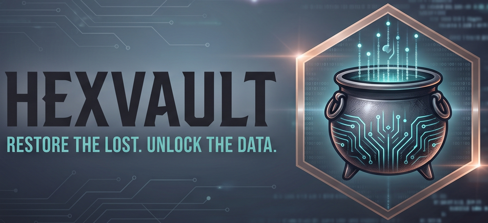

# HexVault | Digital File Recovery



<p align="center">
  
</p>

<p align="center">
  <b>A modern, user-friendly Linux GUI for raw file carving powered by PhotoRec.</b>
</p>

<p align="center">
  <a href="#-features"></a>
  <a href="#-license"></a>
  <a href="https://www.python.org/"></a>
  <a href="https://cgsecurity.org/wiki/PhotoRec"></a>
</p>

---

## 🛠️ Overview

**HexVault** provides a clean, responsive Tkinter desktop interface for recovering deleted files on Linux storage media. By wrapping the powerful **PhotoRec** carving engine into a structured 4-step workflow, HexVault makes deep unallocated disk recovery accessible without needing to navigate complex interactive terminal prompts.

---

## ✨ Features

* 🔐 **Privileged Execution Interlock:** Performs background operations through a single `pkexec` authorization prompt per session.
* 💾 **Disk & Partition Auto-Discovery:** Detects physical drives, filesystems, and mount statuses via `lsblk` and `findmnt`.
* ⚡ **Automatic Unmounting:** Safely unmounts target partitions before carving to prevent data corruption, then automatically remounts them when finished.
* 🎯 **Free Space Carving Only:** Hard-coded to scan unallocated disk space to maximize speed and protect existing active data.
* 📂 **Smart File Classification & Routing:** Automatically sorts recovered raw files into categorized folders (`Images`, `Video`, `Audio`, `Documents`, `Archives`, `Databases`).
* 🔍 **Post-Carving Filters:** Rejects small junk files or low-resolution thumbnail images based on configurable minimum file size and pixel dimension constraints.
* 📊 **Live Monitoring & Logging:** Displays real-time scan progress, live carved file feeds, and outputs a CSV manifest (`PhotoRec_Recovery_Inventory.csv`) detailing all recovered items.
* ⏯️ **Pause & Resume Controls:** Supports instant process suspension (`SIGSTOP` / `SIGCONT`) during long recovery passes.
* 🎨 **Adaptive Theme Support:** Features dynamic Dark and Light modes with system theme auto-detection.
* ⌨️ **Keyboard Shortcuts:** Includes hotkeys for common operations (`Ctrl+Enter` to start, `Space` to pause/resume, `Ctrl+Q` to exit).

---

## 📋 Prerequisites

HexVault requires **Python 3**, **Tkinter**, **Pillow**, and **PhotoRec** (`testdisk`).

### Debian / Ubuntu / Linux Mint / Parrot OS

```bash
sudo apt update
sudo apt install python3 python3-tk python3-pil python3-pil.imagetk testdisk udisks2

Fedora
Bash

sudo dnf install python3 python3-tkinter python3-pillow testdisk udisks2

Arch Linux
Bash

sudo pacman -S python python-pillow testdisk udisks2

🚀 Installation

Clone the repository and run the automated installer with sudo:
Bash

# Clone the repository
git clone [https://github.com/your-username/HexVault.git](https://github.com/your-username/HexVault.git)
cd HexVault

# Make the installer executable and run it
chmod +x install.sh uninstall.sh
sudo ./install.sh

The installer will place the binary in /usr/local/bin/hexvault, create the application directory at /opt/hexvault, install desktop icons, and register HexVault in your system desktop application menu.
Custom Installation Paths
Bash

# Custom launcher location
sudo ./install.sh --bin-dir /usr/bin

# Custom application directory
sudo ./install.sh --app-dir /custom/location/hexvault

🖥️ Usage

You can launch HexVault directly from your application menu under System or Utilities, or run it from any terminal:
Bash

hexvault

🧭 Guided Workflow

    Setup & Drives: Select your target drive and partition. HexVault will display filesystem details and handle unmounting automatically. Choose your destination output folder.

    File Types & Filters: Check the specific file extensions you wish to recover. Optionally set minimum file sizes or pixel dimensions (for images) to drop undesired thumbnails and fragments.

    Execution & Monitoring: Click Start Recovery (or press Ctrl+Enter). Enter your administrator password when prompted. Monitor live log outputs and carved files in real time.

⌨️ Shortcuts
Shortcut	Action
Ctrl + Enter	Start recovery job
Space	Pause / Resume active recovery scan
Ctrl + Q / Ctrl + W	Exit application
🗑️ Uninstallation

To remove HexVault and clean up desktop menu entries and system launchers:
Bash

sudo ./uninstall.sh

🛡️ License

This project is licensed under the GNU General Public License v3.0 (GPLv3). See the LICENSE file for complete details.
Attribution

HexVault is an independent graphical front-end created by Siafu Linux. PhotoRec is a registered trademark of Christophe GRENIER / CGSecurity.
